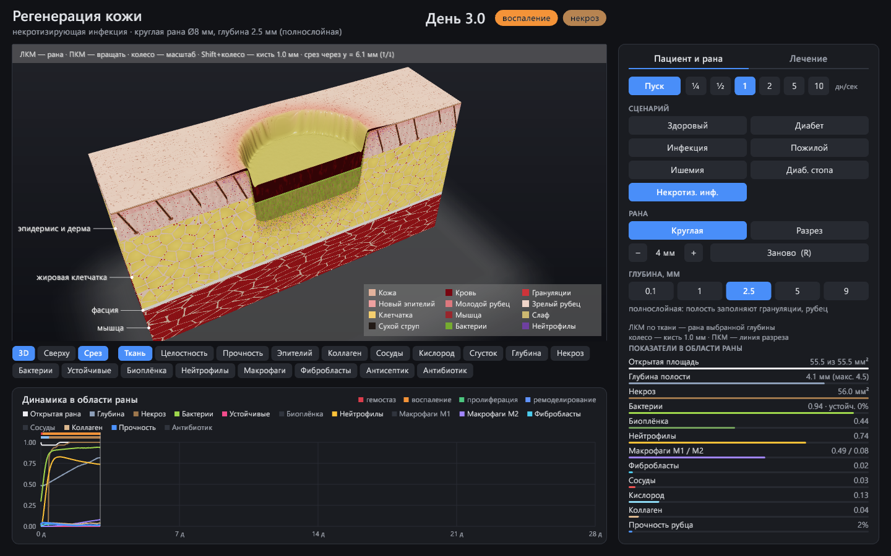

# body-sim — симулятор регенерации тканей человека

Заживление кожной раны на участке 24×12 мм: глубина до мышцы, некроз, инфекция,
лечение антисептиками, антибиотиком и хирургической обработкой. Rust, графика на `macroquad`.



## Графический режим

```bash
cargo run --release
```

- **3D-блок ткани как в анатомическом атласе.** Рельефная поверхность: рана — настоящее
  углубление, залитое кровью, слафом или грануляциями; кожа с порами и кожным рисунком
  (у рубца их нет), влажный блеск раны, мягкое подповерхностное рассеяние, тонмаппинг.
  Грани блока — срезы через слои с выносками: эпидермис, дерма с фолликулами, потовыми
  железами и капиллярами, дольки жира, фасция, пучки мышечных волокон; в ране — сгусток,
  мёртвая ткань, биоплёнка, отдельные бактерии и нейтрофилы. Плюс тепловые карты 17 полей
  прямо на поверхности.
- **Мышь**: ЛКМ — нанести рану выбранной глубины, ПКМ — вращать камеру, колесо — масштаб,
  Shift+колесо — размер кисти, ↑/↓ — сдвинуть плоскость среза, Tab — срез вкл/выкл.
  Наведение — все показатели точки.
- **Вкладка «Пациент и рана»**: 7 сценариев, форма, размер и глубина раны.
- **Вкладка «Лечение»**: 4 антисептика (разовая обработка или перевязки раз в 12/24 ч),
  системный антибиотик (доза раз в 8/12/24 ч, видна концентрация в плазме),
  хирургическая обработка.
- **Шапка**: фаза заживления и клиническое состояние — заживает / хроническая / некроз /
  распространяющаяся инфекция / сепсис.
- **График**: 14 серий (включаются кликом по легенде), полосы фаз и состояния, засечки процедур.
- Пробел — пауза, R — заново, → — шаг на 1 час при паузе.
- Опции для отладки: `--scenario necrotizing --depth 5 --days 3 --cam 0.5,0.7,20 --top --no-cut
  --treat --antibiotic-every 8 --debride 0.5,1.5 --screenshot out.png`.

## Консольный режим

```bash
cargo run --release --bin body-sim -- --scenario diabetic-foot --depth 5 --days 42 --no-map
cargo run --release --bin body-sim -- --scenario necrotizing --antibiotic-every 8 --treat-from 0.5 --debride 0.5,1.5,3
cargo run --release --bin body-sim -- --help
```

## Подход

Регенерацию целого тела сразу не смоделировать, поэтому начинаем с одной ткани — кожи —
и строим ядро так, чтобы потом добавлять ткани и масштабы.

**Континуальная модель «2.5D».** Сетка 96×48 клеток по 0.25 мм (вид сверху). Каждая клетка —
колонка ткани: эпидермис 0.1 мм → дерма 2 мм → жировая клетчатка 6 мм → фасция → мышца.
В клетке хранятся плотности клеток и концентрации сигналов, а также глубина дефекта,
максимальная глубина поражения и толщина мёртвой ткани. Полный 3D (воксели по глубине)
понадобится для карманов и затёков под краями раны — пока не нужен.

### Что моделируется

| Процесс | Как |
|---|---|
| Гемостаз | кровотечение (сильнее в глубоких ранах) → сгусток → тромбоцитарные факторы роста |
| Воспаление | дебрис, бактерии, некроз, биоплёнка → сигнал → нейтрофилы и макрофаги M1; эффероцитоз переключает M1→M2 |
| Глубина | в неглубоких ранах уцелевшая дерма даёт островки эпителия из фолликулов и почти не оставляет рубца; глубокие сначала заполняются грануляциями, и только потом эпителизируются; клетчатка плохо кровоснабжается |
| Кислород | от сосудов и дна раны; воспаление расширяет сосуды (гиперемия) — если артерии на это способны |
| Некроз | ткань гибнет от гипоксии и бактериальных токсинов; мёртвая ткань блокирует заживление, кормит бактерии и недоступна иммунитету и антибиотику; макрофаги медленно её растворяют |
| Инфекция | рост на открытой поверхности и в некрозе (инвазивные штаммы — и в живой ткани); биоплёнка прячет бактерии; фоновая защита живой ткани; лейкоцидины некротизирующих штаммов |
| Антисептики | убивают бактерии на поверхности, частично пробивают биоплёнку, но токсичны для эпителия и фибробластов |
| Антибиотик | фармакокинетика (t½ 2 ч), концентрация в ткани ∝ перфузии, эффект по Хиллу от МПК; устойчивый штамм (МПК ×4) появляется мутациями и отбирается лечением |
| Хирургическая обработка | иссечение некроза и инфицированной ткани (рана становится больше), удаление биоплёнки, «свежее» кровоточащее дно |
| Ремоделирование | созревание коллагена; рубец не прочнее ~84% здоровой кожи |

### Результаты (здоровый пациент, рана Ø8 мм)

| Глубина | Эпителизация | Прочность на 60-й день |
|---|---|---|
| 0.1 мм — эпидермис | 2.5 дн. | 100% |
| 1 мм — дерма | 4.8 дн. | 71% |
| 2.5 мм — полнослойная | 22 дн. | 44% |
| 5 мм — клетчатка | 32 дн. | 44% |
| 9 мм — мышца | не закрылась за 60 дн. | — |

### Сценарии без лечения (глубина 2.5 мм)

| Сценарий | Исход |
|---|---|
| healthy | зажила за 22 дня |
| elderly | 29.5 дня |
| diabetic | хроническая, зажила за 48.6 дня |
| infected | биоплёнка, хроническая, зажила за 48 дней |
| ischemic | сухой некроз дна, не заживает |
| diabetic-foot | некроз + инфекция, не заживает |
| necrotizing | за 2 дня выходит за край раны → сепсис |

### Лечение (42 дня)

| Случай | Исход |
|---|---|
| infected + октенидин каждые 24 ч | зажила за 25 дней |
| infected + повидон-йод каждые 12 ч | 37 дней: токсичность тормозит эпителизацию |
| infected + антибиотик каждые 8 ч | 21.6 дня |
| diabetic-foot + только антибиотик | некроз не уходит, 39% бактерий устойчивы |
| diabetic-foot + санация + октенидин + антибиотик | инфекция и некроз убраны, рана хроническая из-за ишемии |
| necrotizing + только антибиотик | некроз держится |
| necrotizing + ранняя санация (0.5, 1.5, 3 дн.) + антибиотик | зажила за 21.6 дня |
| necrotizing + поздняя санация (3, 4 дн.) + антибиотик | некроз, выжили только устойчивые |

## Архитектура

```
src/
  lib.rs         библиотека body_sim — ядро модели
  params.rs      константы модели, анатомия колонки, 7 клинических сценариев
  grid.rs        Field — скалярное поле на сетке, лапласиан (граница Неймана)
  tissue.rs      Tissue — состояние участка ткани, нанесение раны заданной глубины
  sim.rs         один шаг модели: явный Эйлер, dt = 0.1 ч
  therapy.rs     антисептики, антибиотик (ФК/ФД), хирургическая обработка, журнал процедур
  simulation.rs  прогон во времени: ткань + лечение + почасовая история метрик
  report.rs      метрики, фаза, клиническое состояние, ASCII-карта, CSV
  main.rs        консольный бинарник
  bin/gui/       графический бинарник (macroquad)
    main.rs      состояние приложения, раскладка, вкладки, ввод, камера
    render3d.rs  3D-сцена: меш поверхности, грани-срезы, GLSL-шейдер кожи, орбитальная камера, выбор точки лучом
    paint.rs     внешний вид ткани: цвет/влажность/рельеф поверхности, гистологические текстуры срезов
    chart.rs     график динамики с полосами фаз/состояния и отметками процедур
    ui.rs        кнопки, вкладки, панели, кириллический шрифт из системы
```

## Известные ограничения

- Параметры подобраны качественно под клиническую картину, а не откалиброваны по данным.
- Некротизирующая инфекция лечится одной ранней санацией даже без антибиотика — в реальности нужны оба.
- Устойчивость моделируется одним штаммом с фиксированной МПК; нет смены антибиотика.
- Нет контракции раны, механики, отёка, давления (пролежни), реваскуляризации при ишемии.
- Нет системного уровня: сепсис — это оценка площади инфекции, а не модель организма.
- Клетки — не агенты: нет хемотаксиса и направленной миграции.

## Roadmap

1. **Калибровка** по литературным кривым: площадь раны, клеточный состав, прочность рубца, время эпителизации.
2. **Тесты**: инварианты (здоровая ткань стационарна, поля не уходят в минус), регрессия сценариев.
3. **Лечение дальше**: смена/комбинация антибиотиков, NPWT (вакуум), реваскуляризация, повязки (влажная среда), кожная пластика.
4. **Системный уровень**: температура, лейкоциты, лактат, SOFA — сепсис как состояние пациента.
5. **Механика**: миофибробласты, контракция, качество рубца.
6. **Гибридная модель**: агентные клетки поверх полей.
7. **3D** и производительность: `rayon`, затем `wgpu` compute.
